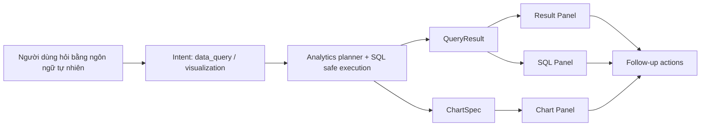

# WrenAI-Style Chart Query Breakdown

## 1. Mục tiêu

Tài liệu này breakdown task đưa trải nghiệm `chart/query` của TechHub tiến gần hơn kiểu `WrenAI-inspired analytics UX`.

Mục tiêu **không** phải clone UI của WrenAI theo pixel, mà là đạt các năng lực người dùng kỳ vọng:

- hỏi dữ liệu bằng ngôn ngữ tự nhiên
- xem ngay bảng kết quả và biểu đồ
- chuyển đổi giữa `answer -> table -> chart -> SQL`
- tinh chỉnh câu hỏi thay vì phải hỏi lại từ đầu
- hiểu rõ dữ liệu đang là `của tôi` hay `toàn hệ thống`
- đủ mượt để dùng như một `AI analyst workspace`, không chỉ là chat preview

## 2. Phạm vi

Trong scope của task này, "hiển thị giống WrenAI" được hiểu là:

- có `query result card` rõ ràng
- có `chart card` rõ ràng
- có khu vực xem SQL hoặc logic truy vấn
- có khả năng đổi loại chart
- có khả năng xem nhiều bước phân tích trong cùng một câu trả lời
- có follow-up action để hỏi tiếp, lọc thêm, hoặc chuyển từ bảng sang chart

Ngoài scope hiện tại:

- semantic modeling đầy đủ như BI product độc lập
- dashboard builder phức tạp nhiều widget drag-drop
- data governance enterprise-level

## 3. Hiện trạng code

### 3.1. Đã có

- Backend đã phân luồng `data_query` và `visualization`.
- Backend đã trả `queryResult` và `chartSpec`.
- FE chat đã render preview bảng dữ liệu.
- FE chat đã render preview chart.
- FE chat đã cho đổi nhanh giữa `bar / line / pie`.
- Backend đã có lớp guard SQL cơ bản và phân biệt một phần `personal` vs `platform`.

Các file đang là nền sẵn có:

- `TechHub_BE/ai-service-fastapi/app/services/analytics_service.py`
- `TechHub_BE/ai-service-fastapi/app/orchestration/nodes/agents/sql_agent_node.py`
- `TechHub_BE/ai-service-fastapi/app/orchestration/nodes/agents/viz_agent_node.py`
- `TechHub_BE/ai-service-fastapi/app/orchestration/router/intent_router.py`
- `TechHub_FE/src/app/(public)/ai-chat/page.tsx`
- `TechHub_FE/src/schemaValidations/ai.schema.ts`
- `TechHub_FE/src/apiRequests/ai.ts`

### 3.2. Chưa có

- chưa có panel xem SQL cho người dùng
- chưa có result grid đầy đủ, mới là preview ngắn trong chat
- chưa có export CSV / download result
- chưa có save query / save chart / save analysis
- chưa có follow-up suggestion kiểu analyst workflow
- chưa có drill-down / filter interaction trên chart
- chưa có workspace riêng cho query/chart, vẫn đang là inline chat
- chưa có clear UX cho nhiều chart hoặc nhiều bước phân tích trong cùng một thread

## 4. Gap so với WrenAI-style UX

| Capability | Hiện trạng | Đánh giá |
| --- | --- | --- |
| Ask data bằng ngôn ngữ tự nhiên | Có | DONE |
| Trả bảng dữ liệu | Có query result panel với summary, row/column stats, pagination và bảng cuộn ngang | DONE |
| Trả biểu đồ | Có chart panel riêng với title, subtitle, scope, series info và chart states | DONE |
| Switch chart type | Có `bar/line/pie` với control rõ ràng ngay trên chart panel | DONE |
| Hiện SQL cho người dùng | Có SQL/Logic panel với raw SQL, explanation, execution mode, tables và runtime policy | DONE |
| Tinh chỉnh query từ UI | Chưa có | NOT DONE |
| Export dữ liệu | Có Export CSV (có BOM UTF-8), Copy table (TSV/Markdown), Download chart PNG (SVG→Canvas @2-3x DPR), Copy SQL | DONE |
| Save query/chart | Có `Lưu` button, persist localStorage (30 entries), sidebar section "Analyses đã lưu", read-only fullscreen viewer (badge `Chỉ xem`) | DONE |
| Drill-down/filter tương tác | Chưa có | NOT DONE |
| Workspace kiểu analyst | Có side-panel workspace + fullscreen overlay (Maximize2) hiển thị đồng thời answer + chart + table + SQL + sources + follow-ups, có Esc + click-outside close | DONE |
| Follow-up questions / next actions | Có `FollowUpActions` component: pill dưới mỗi analytics answer + footer workspace, BE sinh `suggestedActions` + FE fallback | DONE |
| Phân biệt rõ `của tôi` vs `toàn hệ thống` trên UI | Có `ScopeBadge` component (icon + màu green/blue) render nổi bật ở header message, query card, chart card, SQL card và workspace | DONE |

## 5. Mục tiêu UX sau khi hoàn thành

Người dùng hỏi:

`Vẽ biểu đồ tiến độ các khóa học tôi đang theo học`

Hệ thống nên cho ra một cụm UI hoàn chỉnh:

1. `AI answer`
2. `Scope badge`: `Dữ liệu của tôi`
3. `Query result panel`
4. `Chart panel`
5. `SQL/logic panel`
6. `Follow-up actions`

Ví dụ follow-up actions:

- `Đổi sang biểu đồ tròn`
- `Chỉ lấy khóa học đang học`
- `Xuất CSV`
- `Giải thích câu SQL này`
- `So sánh với toàn hệ thống`

## 6. Luồng mục tiêu

## 7. Breakdown công việc

### W1. Query Result Panel

**Mục tiêu**

Nâng từ `preview 5 dòng trong chat bubble` thành panel kết quả đọc được như công cụ analytics.

**Cần làm**

- tách `query result` thành card riêng, không dính cứng trong body text
- hiển thị `scope`, `summary`, `row count`, `columns`
- hỗ trợ bảng có scroll ngang
- hỗ trợ pagination hoặc `view more`
- giữ định dạng số, phần trăm, currency dễ đọc

**File chính**

- `TechHub_FE/src/app/(public)/ai-chat/page.tsx`
- có thể tách thêm component riêng: `QueryResultCard`

**Trạng thái**

- `DONE`

**Definition of Done**

- người dùng xem được bảng dữ liệu mà không bị cảm giác "chat text nhét thêm table nhỏ"
- bảng hiển thị được nhiều dòng hơn preview hiện tại thông qua pagination
- có header, scope, row count, column count và bảng cuộn ngang đủ dùng trên desktop/mobile

### W2. Chart Panel

**Mục tiêu**

Biểu đồ phải trở thành first-class output, không chỉ là một preview tạm.

**Cần làm**

- tách chart thành card riêng
- giữ `title`, `subtitle`, `scope`, `series info`
- hỗ trợ đổi loại chart rõ ràng hơn
- thêm trạng thái `empty`, `all zero`, `single category`, `loading`
- thêm legend và tooltip dễ đọc

**File chính**

- `TechHub_FE/src/app/(public)/ai-chat/page.tsx`

**Trạng thái**

- `DONE`

**Definition of Done**

- biểu đồ có thể đọc được độc lập, không cần nhìn answer text mới hiểu
- người dùng đổi chart type mà không mất context
- trạng thái `empty`, `all zero`, `single category` được hiển thị khác nhau
- header chart có `title`, `subtitle`, `scope`, `series info` và legend/tooltip đủ đọc

### W3. SQL / Logic Panel

**Mục tiêu**

Đưa người dùng từ "AI nói gì" sang "AI truy vấn như thế nào".

**Cần làm**

- FE hiển thị `sql` hoặc `query explanation`
- cho collapse/expand
- phân biệt SQL thật với fallback deterministic logic
- có nút `copy SQL`

**Phụ thuộc backend**

- đảm bảo `queryResult.sql` và/hoặc `queryResult.policy` luôn ổn định
- có thể bổ sung `queryPlan` / `explanation`

**File chính**

- `TechHub_FE/src/app/(public)/ai-chat/page.tsx`
- `TechHub_BE/ai-service-fastapi/app/services/analytics_service.py`

**Trạng thái**

- `DONE`

**Definition of Done**

- người dùng có thể xem logic query mà không cần mở devtools
- có `raw SQL`, `query explanation`, `execution mode`, `tables`, `runtime policy`
- support tốt cho debugging và kiểm chứng dữ liệu

### W4. Follow-up Actions

**Mục tiêu**

Biến chart/query thành workflow liên tục thay vì một câu trả lời đóng.

**Cần làm**

- thêm quick actions dưới query/chart
- gợi ý câu hỏi tiếp theo theo context
- ví dụ:
  - `So sánh theo tháng`
  - `Chỉ lấy dữ liệu của tôi`
  - `Đổi sang biểu đồ đường`
  - `Giải thích vì sao số liệu thấp`

**Phụ thuộc backend**

- có thể trả `suggestedActions` hoặc FE tự sinh từ metadata

**Trạng thái**

- `DONE`

**Definition of Done**

- BE `analytics_service` sinh `suggestedActions` (chart type, scope pivot, explain SQL, refine filter, time pivot, export, copy) và gắn vào `queryResult` + metadata của chat stream/non-stream
- FE có component `FollowUpActions` render dưới mỗi câu trả lời analytics (pill compact) và ở chân workspace (pill đầy đủ)
- Action kinds được hỗ trợ đầy đủ: `prompt`, `change_chart_type` (đổi chart instant trong workspace), `export_csv` (tải file), `copy_sql` (vào clipboard), `refine_filter` (gửi prompt tinh chỉnh)
- FE có fallback tự sinh actions từ metadata khi BE không trả — đảm bảo luôn có 3-5 action mỗi câu trả lời
- Dispatcher disable khi đang streaming, có feedback trực quan (tick xanh) sau khi action chạy xong

### W5. Result Scope UX

**Mục tiêu**

Tránh hiểu nhầm giữa `dữ liệu của tôi` và `dữ liệu toàn hệ thống`.

**Cần làm**

- badge rõ ràng: `Của tôi` / `Toàn hệ thống`
- text summary mở đầu phải nhắc lại scope
- khi người dùng hỏi mơ hồ, hệ thống hoặc clarify hoặc gắn scope mặc định dễ hiểu

**Phụ thuộc backend**

- `scopeLabel` phải ổn định
- entity extraction phải phân biệt tốt `my/me/toi/cua toi/dang theo hoc`

**Trạng thái**

- `DONE`

**Definition of Done**

- Có component `ScopeBadge` tái sử dụng, phân biệt theo màu: xanh lá cho `Dữ liệu của tôi`, xanh dương cho `Toàn hệ thống`, xám cho chưa xác định; đi kèm icon `UserRound` / `Globe` / `Database`
- Badge xuất hiện nổi bật ở: header bubble message, `QueryResultCard`, `ChartPreviewCard`, `SqlPreviewPanel`, header `AnalysisWorkspacePanel`
- Backend `analytics_service._scope_label` luôn trả label cụ thể, `_infer_scope` mở rộng token nhận diện (`toi`, `cua toi`, `dang theo hoc`, v.v.)
- Không còn case user hiểu nhầm số liệu global là số liệu cá nhân vì scope hiện diện xuyên suốt từng panel

### W6. Dedicated Analysis Workspace

**Mục tiêu**

Thoát khỏi mô hình chỉ hiển thị trong bubble chat.

**Cần làm**

- mở `drawer` hoặc `side panel` cho query/chart hiện tại
- cho phép nhìn đồng thời:
  - answer
  - table
  - chart
  - SQL
- giữ conversation ở trái, analysis ở phải

**Trạng thái**

- `DONE`

**Definition of Done**

- Side panel `AnalysisWorkspacePanel` đã có từ W1-W3: conversation bên trái, analysis bên phải, chuyển giữa `Data / SQL / Chart / Sources` qua tab
- Thêm nút `Maximize2` trong header side panel → mở `FullscreenAnalysisView` overlay hiển thị đồng thời: scope badge, AI answer (markdown), Chart card, Query result table, SQL panel, Sources, follow-up actions, tất cả stack trên một scroll view
- Responsive: mobile full-viewport, desktop 2-column grid cho chart + table, SQL fullrow phía dưới
- Điều khiển UX production: khóa body scroll khi mở fullscreen, đóng bằng `Esc` / click nền / nút `Minimize2`, tự động đóng nếu message hiện tại không còn workspace content
- Không phá chat flow: chat phía dưới vẫn giữ state, side panel vẫn mở khi user thu gọn fullscreen

### W7. Export / Save

**Mục tiêu**

Cho phép người dùng sử dụng kết quả ngoài chat.

**Cần làm**

- export CSV
- copy table
- tải chart image
- save analysis để mở lại

**Trạng thái**

- `DONE`

**Definition of Done**

- `Export CSV`: nút `CSV` ở `QueryResultCard`, workspace panel, fullscreen view; file có BOM UTF-8 để Excel mở đúng tiếng Việt; cũng có action pill `Xuất CSV` ở follow-up
- `Copy SQL`: nút `Copy SQL` ở `SqlPreviewPanel`; pill `Sao chép SQL` ở follow-up; dùng `navigator.clipboard.writeText`
- `Copy table`: nút `Copy` ở header `QueryResultCard` — TSV (mặc định, dán được Excel/Sheets) và hỗ trợ Markdown; sanitize tab / newline
- `Tải chart image`: nút `PNG` ở `ChartPreviewCard` — serialize SVG → canvas @ devicePixelRatio (clamp 2-3x) → `toBlob('image/png')`; loading state qua `Loader2` khi render
- `Save analysis`:
  - Nút `Lưu` ở header `AnalysisWorkspacePanel` và `FullscreenAnalysisView`; toggle ngay trên 1 message
  - Persist tại `localStorage` key `ai_chat_saved_analyses_v1`, giới hạn 30 entry, hydrate lại khi reload
  - Sidebar section `Analyses đã lưu` (collapsible) liệt kê title + scope + thời điểm lưu, xoá inline
  - Read-only viewer: `FullscreenAnalysisView` mode `readOnly` hiện badge `Chỉ xem (saved)`, filter follow-up chỉ còn `change_chart_type / export_csv / copy_sql`, nút `Gỡ lưu` (Trash2 icon) thay cho `Đã lưu`
- Toast feedback đầy đủ: Đã xuất CSV / Đã sao chép SQL / Đã sao chép bảng / Đã lưu / Đã bỏ lưu

### W8. Multi-step Analysis State

**Mục tiêu**

Hỗ trợ câu hỏi tiếp nối như analyst thật.

**Cần làm**

- follow-up query thừa hưởng chart/query context trước
- ví dụ:
  - `lọc chỉ còn khóa beginner`
  - `đổi sang biểu đồ đường`
  - `thêm so sánh với toàn hệ thống`
- cần lưu `active analysis state` trong FE metadata hoặc BE session context

**Trạng thái**

- `DONE`

**Definition of Done**

- FE derive `activeAnalysisSnapshot` từ message analytics gần nhất (messageId, title, metric, scope, chartType, timeRange, summary, sql truncate 1.2KB, tables, columns, rowCount, logicSummary)
- FE gắn `context.activeAnalysis` vào mọi chat request qua `buildRequestContext` trừ khi user dismiss
- Chip UI `Đang tinh chỉnh: {title} · {scope} · {chart}` hiện phía trên input với nút X để thoát chế độ refine (per-message dismiss)
- BE `intent_router` thêm tier-0 `active-analysis-refine`: nếu có `activeAnalysis` + user nói ngắn kèm keyword chart swap / filter / compare → route thẳng sang `visualization` hoặc `data_query`
- BE `sql_agent_node` + `viz_agent_node` extract `activeAnalysis` từ `request_context`, truyền xuống `analytics_service.execute(..., prior_analysis=...)`
- `analytics_service`:
  - `_merge_prior_entities`: kế thừa `metric / time_range / scope / enrollment_scope` nếu user không ghi đè
  - `_infer_scope_with_prior`: follow-up không nhắc scope → giữ nguyên scope trước
  - `_detect_chart_swap` + `_plan_from_prior`: nếu chỉ là đổi chart type, re-execute SQL cũ với `chartType` mới, `executionMode=prior_refine` — tiết kiệm 1 lần gọi LLM
  - `_plan_query`: khi có prior_analysis, prompt planner có block `Previous analysis (treat as refinement)` với metric/scope/chartType/timeRange/SQL truncate để LLM biết đang refine
- Không còn case user hỏi "đổi sang biểu đồ đường" phải gõ lại toàn bộ câu hỏi

### W9. Backend Contract Upgrade

**Mục tiêu**

Đủ dữ liệu để FE hiển thị như một analytics product, không chỉ chat text.

**Cần làm**

- chuẩn hóa `queryResult`
- bổ sung trường nếu thiếu:
  - `sql`
  - `rowCount`
  - `scope`
  - `policy`
  - `chartOptions`
  - `suggestedActions`
  - `explanation`
- giữ ổn định giữa stream và non-stream

**File chính**

- `TechHub_BE/ai-service-fastapi/app/schemas/analytics_contract.py` *(new)*
- `TechHub_BE/ai-service-fastapi/app/services/chat_service.py`
- `TechHub_BE/ai-service-fastapi/app/services/analytics_service.py`
- `TechHub_BE/ai-service-fastapi/app/orchestration/nodes/agents/sql_agent_node.py`
- `TechHub_BE/ai-service-fastapi/app/orchestration/nodes/agents/viz_agent_node.py`
- `TechHub_FE/src/schemaValidations/ai.schema.ts`

**Trạng thái**

- `DONE`

**Definition of Done**

- Tạo module contract BE `app/schemas/analytics_contract.py` chứa Pydantic models `QueryResult`, `ChartSpec`, `ChartOptions`, `ColumnMeta`, `SuggestedAction`, `RuntimePolicySnapshot`, `LogicSummary` + constants (`SUPPORTED_CHART_TYPES`, `SUPPORTED_SCOPES`, `SUPPORTED_COLUMN_KINDS`, `SUPPORTED_EMPTY_STATES`, `DEFAULT_COLOR_PALETTE`, `SUGGESTED_ACTION_KINDS`) + helpers (`detect_empty_state`, `build_available_chart_types`, `build_column_meta`, `infer_column_kind`)
- `queryResult` giờ luôn có đủ trường: `metric`, `timeRange`, `title`, `summary`, `rows`, `rowCount`, `columns`, `columnMeta`, `tables`, `sql`, `chartType`, `executionMode`, `explanation`, `logicSummary`, `scope`, `scopeLabel`, `policy`, `suggestedActions`, `chartOptions`
- `chartOptions` mới: `availableChartTypes` (từ dataset/category count), `colorPalette` (sync FE), `emptyState` (`ok | empty | all_zero | single_category`), `valueAxisLabel`, `categoryAxisLabel`, `stacked`, `legend`
- `columnMeta` mới: array `{ name, kind, unit, format, description }`, suy luận `percentage / currency / duration_seconds / datetime / identifier / numeric / category / boolean / text` từ tên + sample value
- `viz_agent_node` embed `options` (= chartOptions) + `scope` + `scopeLabel` + `subtitle` + `note` vào `chartSpec` để FE không phải suy đoán từ queryResult
- `chat_service` stream `artifact` event giờ mirror `done` metadata: emit thêm `suggestedActions` ở top-level cùng `queryResult` (đã chứa đầy đủ `chartOptions`, `columnMeta`) và `chartSpec` (đã embed `options`) — FE nhận cùng shape ở cả 2 deliveries
- FE schema `ai.schema.ts` thêm `ColumnMeta`, `ChartOptions`, `SuggestedAction`, `ChartSpec`, `QueryResult`, `LogicSummary`, `RuntimePolicySnapshot`, `ColumnKind`, `SuggestedActionKind` Zod + TypeScript types (passthrough để forward-compat)
- FE `ChartPreviewCard` tiêu thụ `chartOptions.availableChartTypes` + `colorPalette` + `emptyState` thay vì heuristic client-side
- FE `QueryResultCard` tiêu thụ `columnMeta` cho format: percentage/currency/duration/datetime render đúng thay vì đoán từ tên cột
- Stream và non-stream cùng shape: kiểm chứng qua dump mặc định `QueryResult().model_dump()` giữ đủ 19 key, `ChartSpec().model_dump()` giữ đủ 8 key

## 8. Thứ tự triển khai khuyến nghị

### Phase 1: Làm cho output hiện tại đọc được hơn

- W1 Query Result Panel
- W2 Chart Panel
- W5 Result Scope UX

Kết quả mong muốn:

- chat analytics nhìn đã ra sản phẩm thật hơn
- giảm hiểu nhầm dữ liệu
- ít phụ thuộc backend change lớn

### Phase 2: Làm cho người dùng kiểm chứng được dữ liệu

- W3 SQL / Logic Panel
- W7 Export / Save
- W9 Backend Contract Upgrade

Kết quả mong muốn:

- tăng độ tin cậy
- giảm cảm giác AI "bịa"

### Phase 3: Làm thành workflow kiểu analyst

- W4 Follow-up Actions
- W6 Dedicated Analysis Workspace
- W8 Multi-step Analysis State

Kết quả mong muốn:

- đưa hệ thống từ "AI chat có chart" thành "AI analytics workspace"

## 9. Những gì có thể xem là MVP WrenAI-style

Task này có thể xem là đạt `MVP` khi đủ các điều kiện sau:

- người dùng hỏi dữ liệu tự nhiên và nhận được `answer + table + chart`
- người dùng thấy rõ dữ liệu là `của tôi` hay `toàn hệ thống`
- người dùng có thể đổi loại chart
- người dùng có thể xem SQL hoặc logic truy vấn
- người dùng có thể export CSV
- người dùng có ít nhất 3 follow-up action mà không cần tự nghĩ prompt mới

## 10. Kết luận

Tại thời điểm cập nhật cuối (W1-W9 đã DONE), TechHub đã đạt mức `AI analyst workspace` theo WrenAI-inspired UX:

- Answer / table / chart / SQL hiển thị đồng thời (workspace side panel + fullscreen overlay)
- Scope `Của tôi` vs `Toàn hệ thống` hiện nổi bật ở mọi panel
- 5-7 follow-up actions mỗi câu trả lời analytics (BE-generated + FE fallback)
- Export CSV, Copy table TSV/Markdown, Download chart PNG, Copy SQL, Save analysis (localStorage 30 entries)
- Multi-step refinement: FE gắn `activeAnalysis` vào context, BE `intent_router` + `analytics_service` refine prior SQL / chartType / scope mà không cần planner mới
- Contract BE chuẩn hóa qua `app/schemas/analytics_contract.py`: `queryResult` 19 field, `chartSpec` 8 field, stream/non-stream cùng shape

Breakdown này có thể dùng làm tham chiếu bảo trì; các task còn lại (governance enterprise, dashboard builder drag-drop, semantic modeling) nằm ngoài scope đã thống nhất.
